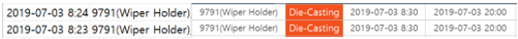
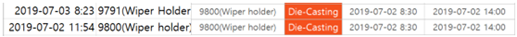
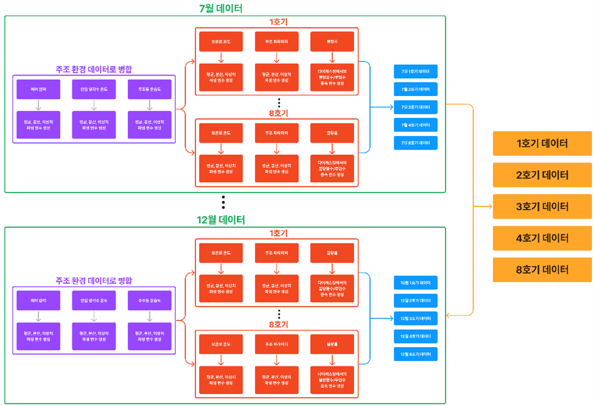
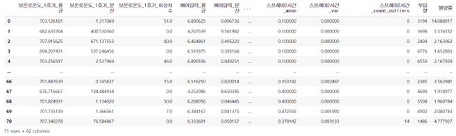
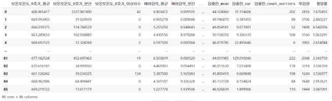
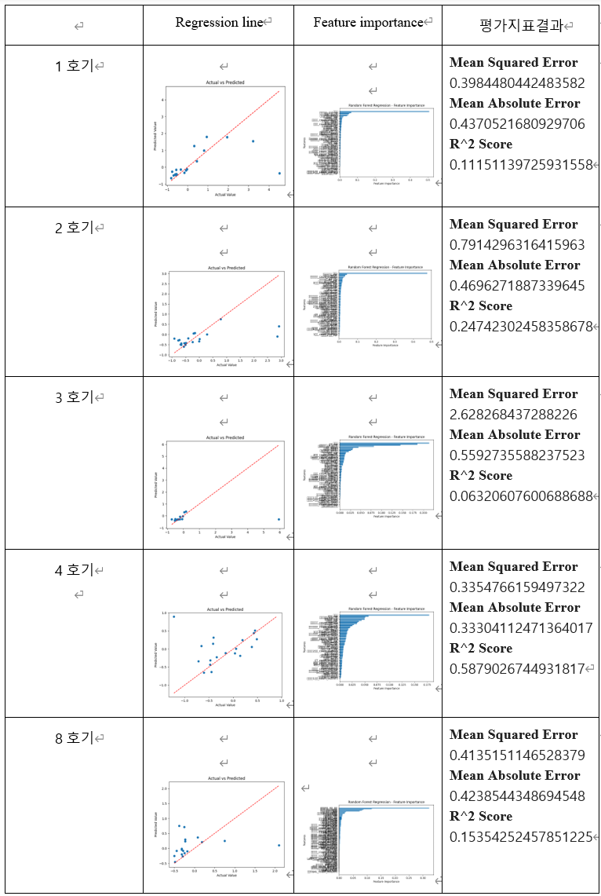
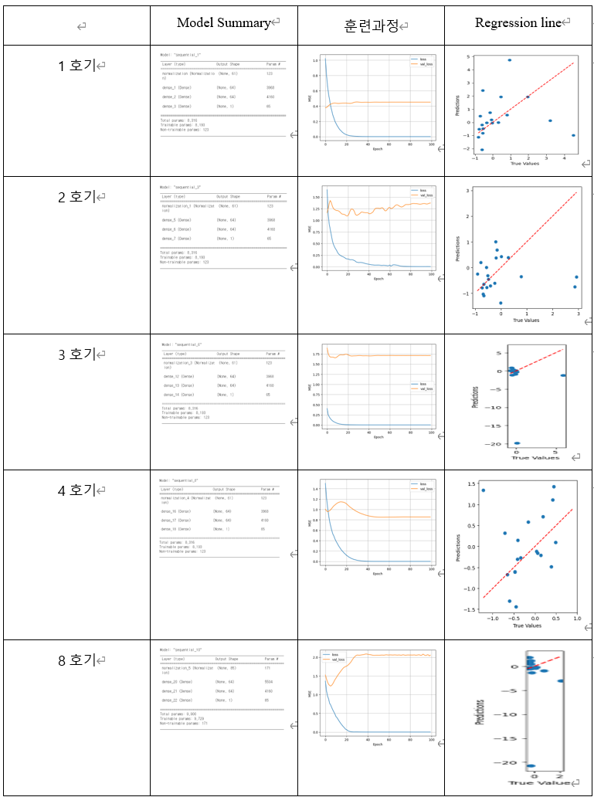

# Project
### 실무 다이캐스팅 공장 전체 IoT 데이터를 활용한 데이터 분석 및 불량 예측 모델 개발

# Intro 
### 📚 Course
산업 인공지능(INE4105-22148)  
### 🗓️ Date 
Project term : 2023.05.17 ~ 2023.06.13  
Presentation Date : 2023.06.14  
### :man: Professor 
  한양대학교 ERICA, 산업경영공학과 오요셉 교수님 
### 👥 Team member 
#### 팀장
  * 산업경영공학과 김윤성

#### 팀원
  * 산업경영공학과 김규현
  * 산업경영공학과 이준범
  * 경제학부 이승재

## 1.  Introduction
A.	프로젝트 소개

(주)다이캐스팅은 다이캐스팅 공정에 초점을 두고 ICT 활용을 통해 공정 데이터를 수집하고 있지만, 데이터 활용을 위한 체계적인 방법론과 시스템이 부족한 상황이다. 특히, 주조 공정에만 초점을 두고 있어 다른 주요 공정인 가공 및 품질 검사에 대한 데이터 수집을 위한 인프라와 시스템이 필요하다. 따라서 이번 프로젝트에서는 다이캐스팅 공정에서 수집된 데이터를 처리하고 분석하여 활용할 계획이다. 주요 목표는 주조 공정 변수와 불량 데이터를 기반으로 한 불량 판정 및 원인 진단 분석을 수행하는 것이다. 다이캐스팅에서 발생하는 불량은 주로 주조 공정에서 발생하기 때문에, 통계적/분석적 접근을 지원하는 시스템과 체계적인 방법론이 필요하다. 또한, 현재 다이캐스팅은 주조 공정이 완료된 후 제품별로 LOT을 부여하고 있어 공정 변수에 따른 불량 상관관계를 파악하기 위한 효과적인 수단이 부족한 상태다. 따라서 주어진 데이터를 기반으로 주조 공정의 불량률을 예측하고 분석하는 것이 이번 프로젝트의 목표이다.

B.	프로젝트 진행 과정

-	프레임워크

 
파이썬 환경에서의 데이터 임포트 문제를 해결하기 위해 파일 저장 및 다시 불러오는 과정을 거친 후, 불량률 예측을 위한 데이터 전처리와 모델링 작업에 대한 결과를 설명한다. 이를 위해 모델링에 필요한 변수들을 적절하게 전처리하여 각 호기별 불량률에 대한 데이터셋을 생성하였다. 그 후 추가적인 전처리 작업을 수행한 뒤, DNN(Dynamic Neural Network)과 랜덤 포레스트(Random Forest) 모델을 사용하여 모델링을 수행하고 성능평가를 진행하였다.

C.	데이터 탐색: 데이터의 특성을 파악하기 위한 분석

-	불량률 예측을 위한 데이터 분석

 
생산진행현황2 파일을 기반으로 전체 데이터를 분석하여 주조공정의 불량률을 파악하였다. 그러나 공정시간이 6시간을 넘어가고 해당 공정에서 발생한 불량률이 합쳐지는 문제로 인해 시간 변동에 따른 불량을 정확히 예측하거나 각 변수들과 불량률 사이의 상관관계를 확인하는 것이 어려움을 판단하였다. 그러나 각 호기에서 하루에 한 가지의 물품이 생산된다는 사실을 확인하였다.

-	불일치 데이터 처리를 위한 공정 시간 파악

 

공정은 8시30분부터 시작한 것으로 추정되지만, 파라미터 데이터는 8시23분부터 기록되어 있으며 이런 경우와 같이 시간이 일치하지 않는 경우가 존재한다.

공정은 14시에 완료되는 것으로 나와 있지만, 파라미터 기록은 11시 54분에 중단되어 데이터가 부족하거나 생산 진행 시간을 정확히 추정하기 어렵다고 판단된다.

실제 데이터에서 주조 파라미터의 공정 시작 시간과 공정 실제 시작 시간이 정확하게 일치하지 않는 것으로 판단되어, 시간에 맞춰 공정이 진행되었다고 가정하기 어렵다고 판단하였다. 이에 따라 하루 단위로 추정하여 분석하는 것을 가정하였다.

따라서, 공정 변수와 불량률 사이의 상관관계를 파악하는 것이 어렵다고 판단되었지만, 대신에 각 날짜별 파일들을 평균, 분산, 이상치 등을 계산하여 날짜별 불량률을 분석하고자 한다. 분산을 사용하는 이유는 변동의 정도를 파악하기 위함, 이상치를 사용하는 이유는 불량률에 영향을 주는 이상한 값들을 확인하기 위함이다.

따라서, 1호기부터 8호기까지의 다이캐스팅 제조 공정에서 발생하는 제품의 불량률을 예측하기 위한 데이터 분석 및 모델링 결과를 제시하고, 이를 위해 다양한 주조 환경 데이터와 공정 변수들을 활용하여 불량률을 예측하는 모델 개발을 목표로 하였다.

D.	데이터 처리 및 모델링 과정

-	Feature Engineering 프레임워크

(1)	에어압력, 인입 냉각수 온도, 주조동온습도와 같은 주조 환경 데이터에 대해 시간에 따른 변수 값의 평균, 분산, 이상치 수와 같은 파생 변수를 생성하였다. 또한, 호기별로 제품을 구분하기 위해 데이터셋을 분류하고, 보온로 온도와 주조 파라미터에 대한 파생 변수를 생성하였다. 불량률은 다이캐스팅 공정에서 투입량과 불량품 수를 나눈 비율로 계산되었다.

(2)	각 호기별로 생성된 주조 환경 파생 변수 데이터, 보온로 온도 파생 변수 데이터, 주조 파라미터 파생 변수 데이터, 그리고 불량률 데이터를 날짜를 기준으로 병합하여 5개 호기에 대한 불량률 데이터셋을 생성했다. 이후, 데이터셋을 전처리하여 결측치를 평균값으로 대체하고, 수치형 변수 이외의 변수들을 삭제하며, 변수들의 범위를 맞추기 위해 스케일링을 수행하였다.

(3)	1호기부터 8호기까지의 데이터셋을 개별적으로 학습과 예측을 수행하기 위해 train set과 test set을 8:2의 비율로 분리하였다. DNN 모델과 랜덤 포레스트 모델을 사용하여 각 호기별 불량률을 예측하였으며, 랜덤 포레스트 모델을 통해 변수의 중요도를 확인하여 불량률 예측에 중요한 영향을 미치는 변수를 식별하였다.

(4)	각 호기별로 학습된 모델의 예측 결과를 분석하고, 모델의 성능을 평가하였다. 또한, 랜덤 포레스트 모델과 DNN 모델의 성능을 비교 분석하여 최적의 모델을 선택하였다.

## 2.	Results 
A.	전처리 결과
기존 데이터에서 얻은 수치들의 평균, 분산, 이상치 개수를 계산하여 각 호기별 파라미터와 공통의 환경적 파라미터들을 날짜 기준으로 병합, 정리하여 데이터프레임화 하였다.

1,2,3,4호기의 경우 파라미터가 보온로 온도를 제외하면 모두 같은 이름을 갖는다. 하지만 8호기의 경우 주조파라미터 부분에서 이전 호기들과는 전혀 다른 측정치가 있음을 확인할 수 있었다. 각 데이터프레임에 공정관리에서 추출한 불량률을 추가하여 모델이 이를 학습하게끔 하였다. 

B.	랜덤 포레스트 모델 학습 결과
위 데이터를 기반으로 랜덤 포레스트 모델에 학습시킨 결과이다. 데이터의 양이 적은 8호기에서는 설명력이 약간 부족할 수 있으나 전반적으로 준수한 결과를 확인할 수 있었다.

C.	DNN 모델 학습 결과
DNN을 이용한 모델의 결과는 다음과 같다. 모두 100번의 학습을 거쳤으며 경사 하강법을 통해 손실을 측정하였다. 학습결과 손실의 차이가 줄어들지 못하였고 몇몇의 경우 설명력이 떨어지는 결과를 받았기에 최종적으로 랜덤 포레스트 모델을 선정하였다.

D.	불량률 예측 결과
랜덤 포레스트 모델로 각 호기마다 불량률에 영향을 미치는 조건들을 Feature Importance로 알아본 결과 대부분의 호기에서 투입량에 따라 불량률에 영향을 많이 미쳤다. 또한 보온로 온도와 주조 환경 조건이 불량률에 크게 영향을 미치는 변수였다. 주조 파라미터 조건 중에서 기존에 있던 변수를 파생변수로 만들어 준 결과 그 중에서도 분산으로 생성한 변수들이 전반적으로 변수 중요도가 높게 나왔다. 
(주)다이캐스팅은 공정 전 위에서 변수 중요도가 높게 나온 변수들을 신경 써서 다룬다면 불량률을 보다 낮출 수 있을 것이다. 예를 들어 4호기는 “주조동 온도”, “3속도”, “주조압력”, “실린더 압력”, “1속도”, “보온로 온도”에 대한 분산 값이 중요하게 나왔으므로 이 조건들의 분산 값이 작아야 불량률을 낮추는데 효과적일 것이다.

## 3. References
논문

-	이기성; 이종찬. “사출 공정에서 불량 예측을 위한 데이터 분석 및 AI 적용 모델”. 한국산학기술학회 논문지, 2022, 23.12: 1001-1008.
-	이창호; 최재권; 남태운. 수치해석에 의한 고압다이캐스팅용 금형설계 및 주조공정해석. 한국주조공학회지 (주조), 2000, 20.6: 400-406.
-	이주연. 다이캐스팅 공정 지능화를 위한 데이터 수집, 처리, 분석 및 활용 기술 개발. 한국생산제조학회지, 2020, 29.6: 441-448.
-	KLOBČAR, Damjan; TUŠEK, Janez; TALJAT, Boštjan. Thermal fatigue of materials for die-casting tooling. Materials Science and Engineering: A, 2008, 472.1-2: 198-207.

# 한계점
- 전체적인 공정에서 센서의 위치를 알 수 없었음
- 주조 공정에서 쇳물을 넣었을때 틀 위치마다의 온도를 알아야 데이터 평가를 할때 더 좋음
- 온도 센서가 아닌 열화상 카메라 데이터로 처리하는 것이 더 좋을 것임
